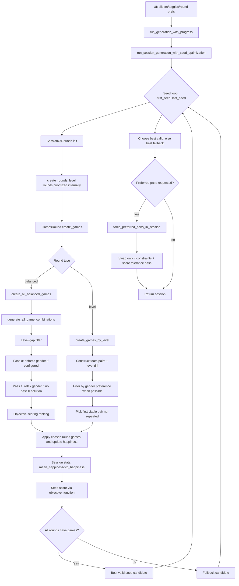

# Happiness Treatment and Iteration Logic (Critical Audit)

Updated: 2026-04-23

## Purpose
This document explains how happiness is actually optimized from UI input to final session choice, with explicit focus on:

- Priority order
- Weights and penalties
- Iteration budget semantics
- Objective functions used at each stage

This replaces the previous implementation-only summary for iterations.

## Scope (Including UI)
Included:

- Core matchmaking and scoring behavior in [core/algorithm.py](../core/algorithm.py)
- Domain model logic in [core/models.py](../core/models.py)
- UI controls and orchestration that influence optimization semantics in [ui/player_selection_ui.py](../ui/player_selection_ui.py)
- Current docs/tests claims in [docs/ITERATIONS_IMPLEMENTATION.md](./ITERATIONS_IMPLEMENTATION.md), [tests/test_iterations.py](../tests/test_iterations.py), [tests/comprehensive_test_iterations.py](../tests/comprehensive_test_iterations.py), and [tests/test_post_processing.py](../tests/test_post_processing.py)

Not included:

- UI visual styling/layout changes
- Implementation of algorithmic fixes in this pass

## End-to-End Visual Flow

Primary anchors:

- [core/algorithm.py:13](../core/algorithm.py#L13)
- [core/algorithm.py:147](../core/algorithm.py#L147)
- [core/models.py:581](../core/models.py#L581)
- [core/models.py:687](../core/models.py#L687)
- [core/models.py:1034](../core/models.py#L1034)
- [ui/player_selection_ui.py:4802](../ui/player_selection_ui.py#L4802)

## Priority Order (Actual Execution)
1. Input normalization and round ordering:
    - Session generation internally prioritizes level rounds first, then may reorder back to UI order.
    - [core/models.py:1706](../core/models.py#L1706), [core/models.py:1724](../core/models.py#L1724), [core/models.py:1798](../core/models.py#L1798), [ui/player_selection_ui.py:4824](../ui/player_selection_ui.py#L4824)

2. Participation priority (who sits out):
    - Players are grouped by games played, shuffled, sorted by increasing happiness within each games-played group, then groups are flattened in descending games-played order.
    - The first `amount_non_playing` players are benched.
    - [core/models.py:609](../core/models.py#L609), [core/models.py:616](../core/models.py#L616), [core/models.py:622](../core/models.py#L622), [core/models.py:629](../core/models.py#L629)

3. Hard feasibility checks in balanced rounds:
    - Level gap tolerance is a hard gate.
    - [core/models.py:751](../core/models.py#L751)

4. Gender preference handling in balanced rounds:
    - Pass 0 enforces gender preference when configured.
    - Pass 1 relaxes gender preference if pass 0 found no solution.
    - [core/models.py:724](../core/models.py#L724), [core/models.py:728](../core/models.py#L728), [core/models.py:758](../core/models.py#L758)

5. Objective ranking among survivors:
    - Balanced candidates are scored via `objective_function(self)`.
    - [core/models.py:789](../core/models.py#L789)

6. Seed-level ranking after all rounds are created:
    - Primary score uses `objective_function(view_of_session_players)`.
    - By default this objective is `mean_min_max_happiness_objective` with UI-configured `lambda_weight`.
    - Fallback to `mean_happiness - lambda_weight * std_happiness` is used only when objective evaluation is incompatible at session seed-selection stage.
    - [core/algorithm.py:16](../core/algorithm.py#L16), [core/algorithm.py:99](../core/algorithm.py#L99), [core/algorithm.py:171](../core/algorithm.py#L171), [core/algorithm.py:183](../core/algorithm.py#L183)

7. Valid-session gate and fallback:
    - Seeds with empty rounds are not eligible for best-valid selection.
    - Best fallback is still kept for no-valid-seed scenarios.
    - [core/algorithm.py:174](../core/algorithm.py#L174), [core/algorithm.py:191](../core/algorithm.py#L191)

8. Optional preferred-pairs post-processing:
    - Swaps must satisfy level gap, games balance, gender validity, and score tolerance.
    - [core/algorithm.py:264](../core/algorithm.py#L264), [core/algorithm.py:307](../core/algorithm.py#L307), [core/algorithm.py:320](../core/algorithm.py#L320)

## Objective Functions and Scoring Layers
### Stage A: Round candidate scoring (balanced rounds)
- Call site: [core/models.py:789](../core/models.py#L789)
- Default objective passed from seed orchestration:
  - [core/algorithm.py:29](../core/algorithm.py#L29)
  - `mean_min_max_happiness_objective(x, lambda_weight=2.4)`

Objective definitions:

- Mean only: [core/models.py:27](../core/models.py#L27)
- Mean minus std: [core/models.py:35](../core/models.py#L35)
- Mean plus bottom-percentile term: [core/models.py:49](../core/models.py#L49)

Current default Stage A formula:

`score_A = mean(happiness_all_participants) + lambda * mean(happiness <= percentile_cut)`

### Stage B: Seed selection scoring
- Call sites: [core/algorithm.py:19](../core/algorithm.py#L19), [core/algorithm.py:176](../core/algorithm.py#L176)
- Formula (primary path):

`score_B = objective_function(view_of_session_players)`

- Fallback formula (only when objective is incompatible at session stage):

`score_B_fallback = session_mean_happiness - lambda_weight * session_std_happiness`

### Stage C: Preferred-pairs post-processing acceptance
- Call sites: [core/algorithm.py:218](../core/algorithm.py#L218), [core/algorithm.py:307](../core/algorithm.py#L307)
- Formula:

`score_C = mean - lambda * std`

Swap accepted only if:

`new_score >= base_score * (1 - score_tolerance)`

## Happiness Modifiers and Weights
Main update function: [core/models.py:103](../core/models.py#L103)

| Modifier | Effective Formula | Default Values | Evidence |
|---|---|---|---|
| Repeated teammate penalty | `-weight_same_teammate * has_same_teammate` | usually `weight_same_teammate=5` in session path | [core/models.py:188](../core/models.py#L188), [core/models.py:1488](../core/models.py#L1488), [ui/player_selection_ui.py:4860](../ui/player_selection_ui.py#L4860) |
| Repeated opponents/same-game people penalty | `-(weight_same_teammate/2) * amount_same_people_in_game_history` | derived from same weight | [core/models.py:192](../core/models.py#L192) |
| Never-met bonus | `+min(count * never_met_bonus_per_player, never_met_bonus_cap)` | per player `2`, cap `4` | [core/models.py:195](../core/models.py#L195), [core/models.py:467](../core/models.py#L467), [core/models.py:1489](../core/models.py#L1489) |
| Gender dissatisfaction penalty | `-5` in spectrum mode, else `-2` | mode-dependent | [core/models.py:202](../core/models.py#L202), [core/models.py:203](../core/models.py#L203) |
| Minority-gender mixed bonus | `+1` if player is minority gender in mixed game | fixed +1 | [core/models.py:206](../core/models.py#L206), [core/models.py:208](../core/models.py#L208) |
| Level bonus in level rounds | `+1` when player level above relevant median | fixed +1 | [core/models.py:213](../core/models.py#L213), [core/models.py:220](../core/models.py#L220) |
| Spectrum preference gain | add selected spec weight when condition met | from player spectrum columns | [core/models.py:132](../core/models.py#L132), [core/models.py:165](../core/models.py#L165) |
| Non-spectrum competitive gain | `+high_level_teammates + high_level_opponents` | dynamic count | [core/models.py:172](../core/models.py#L172), [core/models.py:181](../core/models.py#L181) |

## Iteration Budget and Sampling Semantics
### Balanced rounds
- Generation function uses recursive sampling with an early stop cap:
  - `max_combinations = self.num_iter`
  - [core/models.py:836](../core/models.py#L836)

Important practical meaning:

- `create_all_balanced_games` now evaluates the generated combinations directly, without a second downstream truncation pass.
- Therefore, this is not exhaustive search; it is bounded/sampled search.

### Two-pass gender behavior and iterations recording
- Iteration records include both pass 0 (gender-enforced when configured) and pass 1 (relaxed fallback), with telemetry fields `pass_num`, `gender_enforced`, and `selected`.
- The selected candidate is explicitly flagged in `self.iterations`.
- Evidence: [core/models.py:741](../core/models.py#L741), [core/models.py:809](../core/models.py#L809), [core/models.py:814](../core/models.py#L814)

### Level rounds
- For each game group, all generated team pairings are stored in iterations as `(teams, level_diff, game_num)`.
- Evidence: [core/models.py:1170](../core/models.py#L1170)

## UI-to-Core Semantics (Why UI Must Be Included)
UI orchestration and labels materially affect interpretation of optimization behavior.

| UI Surface | Actual Wiring | Evidence | Risk |
|---|---|---|---|
| "minimize happiness gap" slider (`lambda_weight_var`) | Passed to Stage A objective lambda, Stage B seed ranking objective, and Stage C preferred-pairs tolerance score | [ui/player_selection_ui.py:1382](../ui/player_selection_ui.py#L1382), [ui/player_selection_ui.py:4859](../ui/player_selection_ui.py#L4859), [ui/player_selection_ui.py:4860](../ui/player_selection_ui.py#L4860), [ui/player_selection_ui.py:4878](../ui/player_selection_ui.py#L4878) | Remaining risk is only in edge fallback path when objective function cannot be evaluated at session stage |
| Internal generation order | UI computes `rounds_reordering`; core also prioritizes level rounds internally before optional reorder | [ui/player_selection_ui.py:4824](../ui/player_selection_ui.py#L4824), [core/models.py:1708](../core/models.py#L1708), [core/models.py:1798](../core/models.py#L1798) | Harder to reason about round-by-round causality without explicit documentation |
| Games Editor score strip | Uses mean+lambda*bottom-percent wording and same lambda as UI slider at session start | [ui/player_selection_ui.py:2680](../ui/player_selection_ui.py#L2680), [ui/player_selection_ui.py:2660](../ui/player_selection_ui.py#L2660) | Improves Stage A alignment but can still differ from Stage C post-processing score semantics |

## Minimum Test Additions to Prevent Regression
Suggested additions (new or migrated pytest-style tests):

1. Serialization round-trip objective test:
    - Implemented in [tests/test_pickle.py](../tests/test_pickle.py): objective marker/parameters preserved on save/load and legacy marker compatibility path verified.

2. Fallback warning path test:
    - Pass an objective function incompatible with session-stage adapter and assert fallback behavior/warning is stable.

3. Sampling semantics test:
    - Implemented in [tests/test_iterations.py](../tests/test_iterations.py): balanced iteration count asserted to be `<= num_iter`.

## Notes for Readers
If your goal is to reason about "best session" behavior, evaluate all three scoring layers together:

- Stage A chooses best game combinations within rounds.
- Stage B chooses best seed/session.
- Stage C limits score degradation during preferred-pairs post-processing.

Treating only one layer as "the objective" can produce misleading conclusions.
