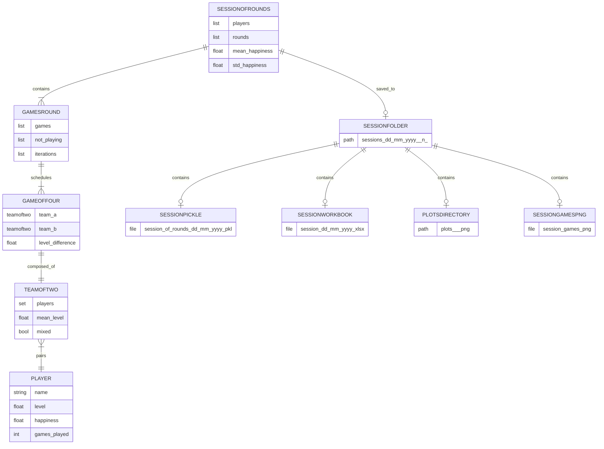

# Session Creation Diagram

> This document is generated. Do not edit by hand.
> Source of truth: docs/diagrams/session_creation/session_diagram_registry.json

Dynamic call flow and data model for session creation and persistence.

## Call Flow

```mermaid
flowchart LR
  subgraph layer_ui["UI"]
    ui_run_session["PlayerSelectionUI.run_session"]
    ui_run_generation_with_progress["PlayerSelectionUI.run_generation_with_progress"]
    ui_load_existing_session["SessionGenerationTabMixin._load_existing_session"]
    ui_restore_session_version["GamesEditorTabMixin._restore_session_version"]
  end
  subgraph layer_core["Core Orchestration"]
    core_seed_optimization["run_session_generation_with_seed_optimization"]
    core_force_pairs["force_preferred_pairs_in_session"]
  end
  subgraph layer_model["Domain Models"]
    model_session_init["SessionOfRounds.__init__"]
    model_create_rounds["SessionOfRounds.create_rounds"]
    model_games_round_init["GamesRound.__init__"]
    model_create_games["GamesRound.create_games"]
    model_create_balanced["GamesRound.create_all_balanced_games"]
    model_create_by_level["GamesRound.create_games_by_level"]
    model_update_happiness["GameOfFour.update_players_happiness"]
  end
  subgraph layer_output["Persistence and Output"]
    output_save_session_of_rounds["SessionOfRounds.save_session_of_rounds"]
    output_save_pickle["save_session"]
    output_export_excel["SessionOfRounds.export_to_excel"]
    output_create_charts["create_all_session_charts"]
    output_create_session_png["create_session_games_png"]
  end
  ui_run_session -->|calls| ui_run_generation_with_progress
  ui_run_generation_with_progress -->|calls with rounds_reordering + callback| core_seed_optimization
  core_seed_optimization -->|per seed| model_session_init
  model_session_init -->|initializes rounds| model_create_rounds
  model_create_rounds -->|for each round| model_games_round_init
  model_games_round_init -->|dispatch| model_create_games
  model_create_games -->|type=balanced| model_create_balanced
  model_create_games -->|type=level| model_create_by_level
  model_create_balanced -->|scores each candidate| model_update_happiness
  model_create_by_level -->|updates selected games| model_update_happiness
  ui_run_generation_with_progress -->|optional if preferred_pairs| core_force_pairs
  ui_run_generation_with_progress -->|save generated session| output_save_session_of_rounds
  output_save_session_of_rounds -->|always| output_save_pickle
  output_save_session_of_rounds -->|if export_to_excel| output_export_excel
  output_save_session_of_rounds -->|if create_plots| output_create_charts
  ui_run_generation_with_progress -->|UI preview| output_create_session_png
  ui_load_existing_session -->|loads pkl via load_session| output_save_pickle
  ui_restore_session_version -->|loads versioned pkl via load_session| output_save_pickle
```

## Function Nodes
| Node | Layer | Location | Key Parameters | Notes |
|---|---|---|---|---|
| PlayerSelectionUI.run_session | UI | [ui/player_selection_ui.py:4686](../../../ui/player_selection_ui.py#L4686) | selected_players, type_preferences, gender_preferences, games_per_round, level_gap_tol, lambda_weight, spectrum_enabled, preferred_pairs | Collects UI state, applies temporary player overrides, and prepares sub_df. |
| PlayerSelectionUI.run_generation_with_progress | UI | [ui/player_selection_ui.py:4802](../../../ui/player_selection_ui.py#L4802) | sub_df, amount_of_rounds, type_preferences, gender_preferences, first_seed, last_seed, games_per_round, level_gap_tol, lambda_weight, spectrum_enabled, preferred_pairs | Builds rounds_reordering and invokes core generation with progress callback. |
| run_session_generation_with_seed_optimization | Core Orchestration | [core/algorithm.py:13](../../../core/algorithm.py#L13) | df, amount_of_rounds, type_preferences, gender_preferences, rounds_reordering, level_gap_tol, num_iter, lambda_weight, weight_same_teammate, first_seed, last_seed, spectrum, games_per_round_each_round, progress_callback | Runs seed loop and chooses the best scoring valid session. |
| SessionOfRounds.__init__ | Domain Models | [core/models.py:1473](../../../core/models.py#L1473) | list_of_players, amount_of_rounds, games_per_round_each_round, type_preferences, gender_preferences, rounds_reordering, level_gap_tol, num_iter, spectrum, objective_function, weight_same_teammate, seed | Normalizes preferences and triggers round creation. |
| SessionOfRounds.create_rounds | Domain Models | [core/models.py:1706](../../../core/models.py#L1706) | seed | Creates each GamesRound and computes session-level happiness stats. |
| GamesRound.__init__ | Domain Models | [core/models.py:450](../../../core/models.py#L450) | list_of_players, previous_games_rounds_anti_chron, amount_of_games, type_preference, gender_preference, num_iter, level_gap_tol, objective_function, weight_same_teammate, seed, spectrum | Initializes round state and dispatches game creation. |
| GamesRound.create_games | Domain Models | [core/models.py:671](../../../core/models.py#L671) | seed | Routes to balanced or level strategy and tracks per-player history. |
| GamesRound.create_all_balanced_games | Domain Models | [core/models.py:735](../../../core/models.py#L735) | people_playing, level_gap_tol, spectrum, objective_function, seed | Scores candidate game combinations and picks the best one. |
| GamesRound.create_games_by_level | Domain Models | [core/models.py:999](../../../core/models.py#L999) | alternate, seed | Builds level-grouped games and enforces best-available gender pairing. |
| GameOfFour.update_players_happiness | Domain Models | [core/models.py:367](../../../core/models.py#L367) | session_median_level, level_gap_tol, spectrum, type_preference, gender_preference, never_met_bonus_per_player, never_met_bonus_cap | Applies penalties and bonuses, then updates player happiness. |
| force_preferred_pairs_in_session | Core Orchestration | [core/algorithm.py:315](../../../core/algorithm.py#L315) | session, preferred_pairs, forced_games, lambda_weight, score_tolerance | Optional post-processing to enforce preferred teammates. |
| SessionOfRounds.save_session_of_rounds | Persistence and Output | [core/models.py:2633](../../../core/models.py#L2633) | date_str, main_folder, export_to_excel, create_plots | Creates session folder and dispatches serialization and exports. |
| save_session | Persistence and Output | [core/pickle_helper.py:13](../../../core/pickle_helper.py#L13) | session_of_rounds, folder, filename | Writes pickle snapshot using highest protocol. |
| SessionOfRounds.export_to_excel | Persistence and Output | [core/models.py:2283](../../../core/models.py#L2283) | directory, date_str, filename, create_read_only | Exports games and statistics workbook plus read-only variant. |
| create_all_session_charts | Persistence and Output | [core/charts.py:867](../../../core/charts.py#L867) | session_of_rounds, save_png, png_dir | Generates happiness, team, and spectrum charts. |
| create_session_games_png | Persistence and Output | [core/charts.py:917](../../../core/charts.py#L917) | session_of_rounds, save_path, show_levels | Renders a round-by-round session overview image for UI display. |
| SessionGenerationTabMixin._load_existing_session | UI | [ui/tabs/session_generation_tab.py:0](../../../ui/tabs/session_generation_tab.py#L0) | - | Opens a file dialog in sessions/, deserializes the chosen pkl, stamps missing objective metadata, sets _active_session_folder, then opens the Games Editor / Session Games / Plots tabs. |
| GamesEditorTabMixin._restore_session_version | UI | [ui/tabs/games_editor_tab.py:0](../../../ui/tabs/games_editor_tab.py#L0) | pkl_path | Loads a versioned pkl snapshot, updates session_of_rounds, truncates score history to the chosen point via _pending_restore_history, then rebuilds the Games Editor. |

## Data Model

## Entities
| Entity | Kind | Location | Attributes |
|---|---|---|---|
| Player | class | [core/models.py:61](../../../core/models.py#L61) | string name, float level, float happiness, int games_played |
| TeamOfTwo | class | [core/models.py:238](../../../core/models.py#L238) | set players, float mean_level, bool mixed |
| GameOfFour | class | [core/models.py:297](../../../core/models.py#L297) | TeamOfTwo team_A, TeamOfTwo team_B, float level_difference |
| GamesRound | class | [core/models.py:449](../../../core/models.py#L449) | list games, list not_playing, list iterations |
| SessionOfRounds | class | [core/models.py:1470](../../../core/models.py#L1470) | list players, list rounds, float mean_happiness, float std_happiness |
| SessionFolder | artifact | [core/models.py:2633](../../../core/models.py#L2633) | path sessions/DD_MM_YYYY[_N] |
| SessionPickle | artifact | [core/models.py:2654](../../../core/models.py#L2654) | file session_of_rounds_DD_MM_YYYY.pkl |
| SessionWorkbook | artifact | [core/models.py:2660](../../../core/models.py#L2660) | file session_DD_MM_YYYY.xlsx |
| PlotsDirectory | artifact | [core/models.py:2663](../../../core/models.py#L2663) | path plots/*.png |
| SessionGamesPng | artifact | [ui/player_selection_ui.py:4931](../../../ui/player_selection_ui.py#L4931) | file session_games.png |

## Parameter Matrix
### UI Inputs
| Parameter | Source | Passed To | Default | Type | Notes |
|---|---|---|---|---|---|
| amount_of_rounds | num_rounds_var (UI) | run_session_generation_with_seed_optimization(amount_of_rounds) | 4 | int | Rounds count selected in UI. |
| type_preferences | type_prefs[] (UI) | run_session_generation_with_seed_optimization(type_preferences) | [balanced, balanced, level, level] | list[str] | Used with rounds_reordering for internal generation order. |
| gender_preferences | gender_prefs[] (UI) | run_session_generation_with_seed_optimization(gender_preferences) | [open, mixed, mixed, open] | list[str] | Per-round gender constraints. |
| games_per_round | games_per_round_var (UI) | games_per_round_each_round | auto => len(selected_players) // 4 | int | Auto is resolved before core call. |
| level_gap_tol | level_gap_tol_var (UI) | run_session_generation_with_seed_optimization(level_gap_tol) | 1.1 | float | Tolerance for acceptable team level gaps. |
| lambda_weight | lambda_weight_var (UI) | run_session_generation_with_seed_optimization(lambda_weight) | 2.4 | float | Score objective uses mean - lambda * std. |
| spectrum_enabled | spectrum_var (UI) | run_session_generation_with_seed_optimization(spectrum) | True | bool | Switches spectrum-based happiness logic. |
| preferred_pairs | preferred_pairs (UI dialog) | force_preferred_pairs_in_session(preferred_pairs) | [] | list[tuple[frozenset, int]] | Applied only in optional post-processing. |

### Core Orchestration
| Parameter | Source | Passed To | Default | Type | Notes |
|---|---|---|---|---|---|
| num_iter | hardcoded in UI wrapper | run_session_generation_with_seed_optimization(num_iter) | 435 | int | Optimization iteration budget. |
| weight_same_teammate | hardcoded in UI wrapper | run_session_generation_with_seed_optimization(weight_same_teammate) | 5 | int | Penalty for repeated teammates. |
| first_seed / last_seed | hardcoded in UI wrapper | run_session_generation_with_seed_optimization(first_seed, last_seed) | 0 / 9 | int | Seed range used by optimization loop. |

### Persistence
| Parameter | Source | Passed To | Default | Type | Notes |
|---|---|---|---|---|---|
| date_str | save_session_of_rounds default | session folder and filenames | datetime.now().strftime('%d_%m_%Y') | str | Date-based folder name with optional numeric suffix. |
| main_folder | save_session_of_rounds default | os.path.join(main_folder, date_str) | sessions | str | Base directory for runtime session artifacts. |
| export_to_excel | save_session_of_rounds default | SessionOfRounds.export_to_excel | True | bool | Controls workbook generation. |
| create_plots | save_session_of_rounds default | create_all_session_charts | True | bool | Controls charts creation under plots directory. |

## Session Artifacts
| Artifact | Path Pattern | Generated By | Notes |
|---|---|---|---|
| Session folder | sessions/DD_MM_YYYY[_N]/ | SessionOfRounds.save_session_of_rounds | Suffix is added when the date folder already exists. |
| Session pickle | sessions/DD_MM_YYYY[_N]/session_of_rounds_DD_MM_YYYY.pkl | save_session | Serialized SessionOfRounds snapshot. Never overwritten after generation. |
| Versioned pickle snapshot | sessions/DD_MM_YYYY[_N]/session_of_rounds_DD_MM_YYYY_vN.pkl | GamesEditorTabMixin.apply_changes | Numbered snapshot created on each Apply Changes (v1, v2, …). Original pkl is preserved. |
| Session workbook | sessions/DD_MM_YYYY[_N]/session_DD_MM_YYYY.xlsx | SessionOfRounds.export_to_excel | Includes Games, stats, and summary sheets. |
| Read-only workbook | sessions/DD_MM_YYYY[_N]/session_DD_MM_YYYY_read_only.xlsx | SessionOfRounds.export_to_excel | Protected workbook variant generated by export. |
| Charts directory | sessions/DD_MM_YYYY[_N]/plots/*.png | create_all_session_charts | Happiness, team, and spectrum analysis images. |
| Session games preview | sessions/DD_MM_YYYY[_N]/session_games.png | create_session_games_png | UI overview image rendered after session save. |

## How To Add a Feature
1. Add or update node entries in nodes.
2. Add new call edges in edges.
3. Add entity and relationship entries if the feature changes data model or artifacts.
4. Add parameter rows for new user or core knobs.
5. Run: python docs/diagrams/session_creation/generate_session_diagram.py
6. Validate freshness: python docs/diagrams/session_creation/generate_session_diagram.py --check
